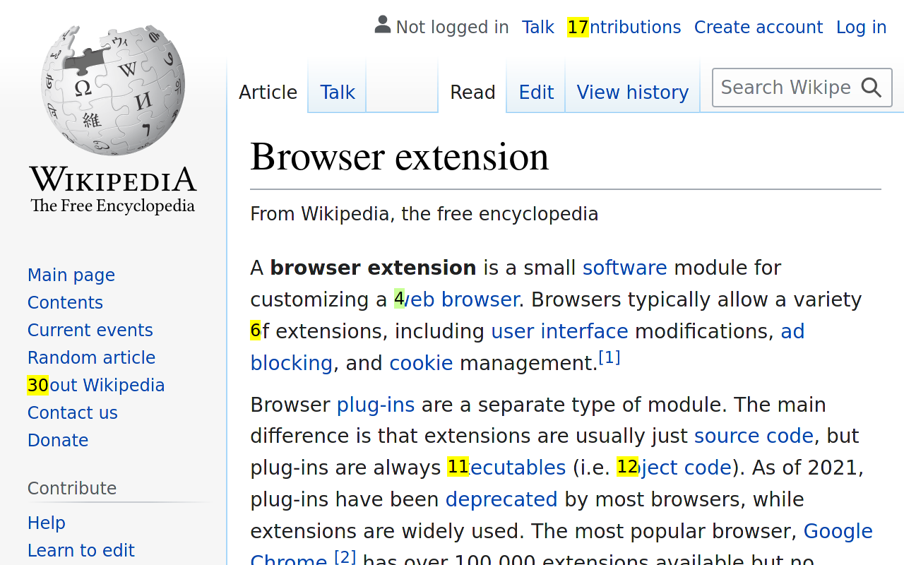

# keyn

[](https://github.com/jelford/keyn/actions/workflows/build.yml)

`keyn` is a browser extension that adds keyboard navigation.

Install it from:
- Firefox: [here](https://addons.mozilla.org/en-GB/firefox/addon/keyn)
- Chrome: [here](https://chrome.google.com/webstore/detail/hadckfabmbpghnjbnfollclmdmokeohc?authuser=0&hl=en-GB)



## usage

Press `Ctrl+,` to show nav hints:


Let's navigate to the issues page. `keyn` filters as you type - start with `is`:


Finally select the link you want by typing the number next to it:


Follow the link with `Enter` (`Shift+Enter` for a new tab, `Alt+Enter` for a background tab).

## configuration

You can customize the activation key (default: `Ctrl+,`) in the addon settings screen.

* Go to: `about:addons`
* Select the cog at the top of the list
* Select "Manage Extension Shortcuts"

# developer documentation

## dev setup

You will need Firefox, Chrome, their respective Webdriver plugins (for testng), and the normal Node stuff.
For convenience you can use [this toolbox](https://github.com/jelford/webdev-toolbox):

```
toolbox create -i ghcr.io/jelford/webdev-toolbox:latest -c webdev
toolbox enter webdev
npm install
```

## building

Build using Mozilla's [`web-ext`](https://extensionworkshop.com/documentation/develop/getting-started-with-web-ext/) tool:

```
npx web-ext lint
npx web-ext build
```

Output will be under `web-ext-artifacts` and should be compatible with Firefox or
Chrome. 

## releasing

`keyn` uses [bumpversion](https://pypi.org/project/bumpversion/) and a python wrapper to document/automate the release

```
./release.py patch # or major/minor
```
This will:
- Run lints
- Run `bumpversion`
- Build a new artifact
- Provide links to extension web stores (manual upload)

## dependencies

`keyn` uses only one third-part dependency: [`webextension-polyfill`](https://github.com/mozilla/webextension-polyfill). 
It's used in [unbundled form](https://github.com/mozilla/webextension-polyfill#basic-setup),
downloaded into the `libs/` folder. Update by replacing with the latest version.
